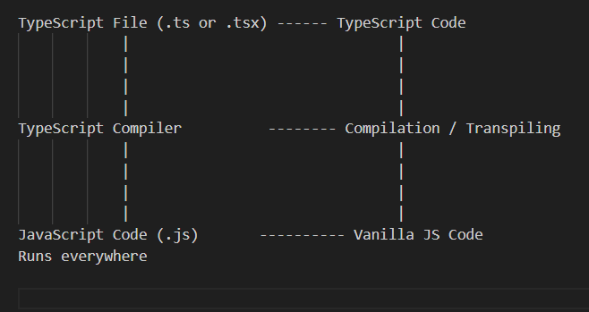

## TypeScript Info

()

## Interface vs Type Alias

A type alias is a way to give a name to a type. It can represent primitive types, union types, intersection types, tuples and any other types.
Interfaces are a way to define the structure of an object.
